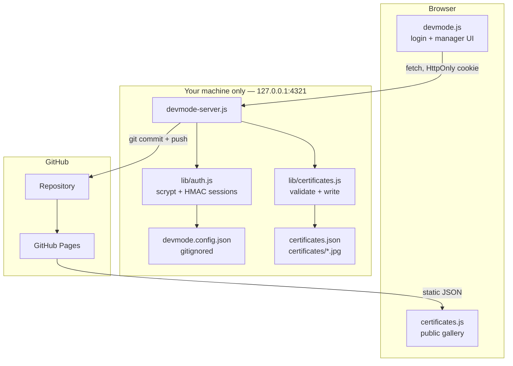
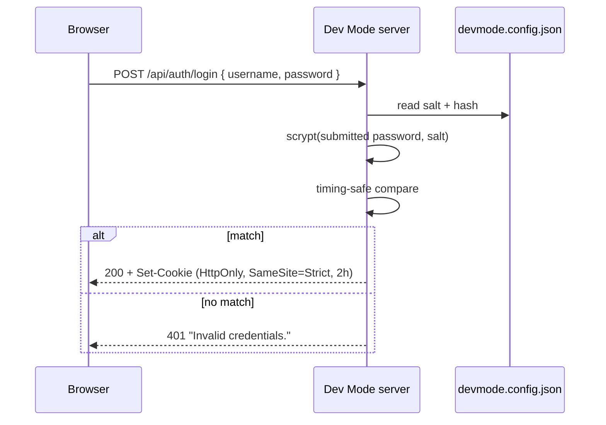
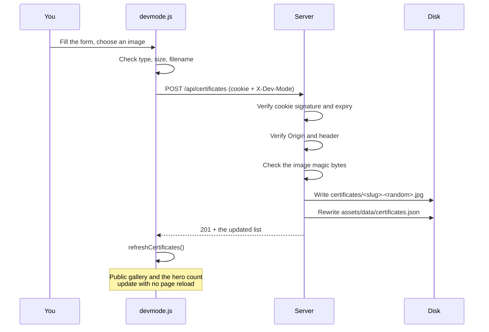

# Dev Mode — Certification Management

How the private certification manager works, and why it is built this way.

---

## 1. The problem it solves

The public portfolio is a **static GitHub Pages site**. A static host has two
properties that matter here:

1. It can only serve files. There is no server-side code to run.
2. Everything it serves is public. It cannot keep a secret.

That rules out the obvious approach. Putting a password check in the browser —

```js
if (username === '*******' && password === '******') { /* ... */ }   // never do this
```

— is not authentication. Anyone can read it with **View Source**. The same is
true of an API token: shipping one to the browser publishes it.

So the read path and the write path are deliberately split.

| Path | Where it runs | Who can reach it |
| --- | --- | --- |
| **Read** — display certificates | GitHub Pages, static | Everyone |
| **Write** — add / edit / delete | A local Node server on your machine | Only you |

Both sides share one file, `assets/data/certificates.json`. The public site
reads it. Dev Mode writes it.

---

## 2. Architecture



### Files

| File | Responsibility |
| --- | --- |
| `server/devmode-server.js` | HTTP server, routing, request guards, publish |
| `server/lib/auth.js` | Password hashing, sessions, rate limiting |
| `server/lib/certificates.js` | Validation, image writing, manifest updates |
| `server/devmode.config.json` | Password hash and session secret — **gitignored** |
| `assets/js/devmode.js` | The UI. Holds no credentials and no tokens |
| `assets/js/certificates.js` | Renders the public gallery, reads the manifest |
| `assets/data/certificates.json` | The manifest — single source of truth |
| `certificates/` | The image files |

---

## 3. Authentication

### Where the password lives

It is **never** in any file that gets committed. On first run the server creates
`server/devmode.config.json` with permissions `0600` and writes a
**scrypt hash**, not the password itself:

```
scrypt(password, salt, { N: 16384, r: 8, p: 1, keylen: 64 })
```

scrypt is deliberately slow and memory-hard, so guessing at scale is expensive.
The salt is 16 random bytes, so two identical passwords produce different
hashes and precomputed tables are useless. The file is listed in `.gitignore`,
so it never reaches GitHub.

### The login exchange



The password is checked **on the server**. The browser only ever learns
"yes" or "no".

### The session cookie

```
vs_devmode=<payload>.<hmac>; Path=/; HttpOnly; SameSite=Strict; Max-Age=7200
```

- The payload is base64url; the signature is **HMAC-SHA256** over it, using a
  48-byte secret that exists only in your config file. Editing the payload
  invalidates the signature, so a session cannot be forged.
- `HttpOnly` means JavaScript cannot read it — `document.cookie` returns `""`.
  Even a successful XSS cannot steal it.
- `SameSite=Strict` means another site cannot make your browser send it.
- It expires after **2 hours**.

### Defences

| Attack | Defence |
| --- | --- |
| Brute force | 5 attempts per IP, then a 15-minute lockout |
| Username enumeration | Unknown users still run a full scrypt derivation, so timing does not leak whether the name exists. The error text is identical either way |
| Timing analysis on compare | SHA-256 normalise, then `timingSafeEqual` |
| Cookie forgery | HMAC signature over the payload |
| Cookie theft via XSS | `HttpOnly` |
| CSRF | An `X-Dev-Mode: 1` header is required, plus an `Origin` check. A plain cross-site form post cannot set custom headers |
| Session survival after a password change | Changing the password rotates the session secret, invalidating every existing session |

> **There is no sign-up.** There is exactly one account, created locally on
> first run. No registration endpoint exists.

---

## 4. Request flow for a write



Every guard runs **again on the server**. The browser-side checks exist only to
give fast feedback; they are not trusted, because anyone can call the API
directly.

### Endpoints

| Method | Route | Purpose |
| --- | --- | --- |
| `GET` | `/api/health` | Is Dev Mode running? The only route open without a session |
| `POST` | `/api/auth/login` | Exchange credentials for a session cookie |
| `POST` | `/api/auth/logout` | Clear the session |
| `GET` | `/api/auth/session` | Is the current session still valid? |
| `POST` | `/api/auth/password` | Change the password |
| `GET` | `/api/certificates` | List |
| `POST` | `/api/certificates` | Create |
| `PUT` | `/api/certificates/:id` | Update in place |
| `DELETE` | `/api/certificates/:id` | Remove |
| `POST` | `/api/publish` | Commit and push |

Everything except `/api/health` returns **401** without a valid session.

---

## 5. Upload safety

An image upload is the most dangerous input the server accepts, so it is
checked four ways.

**1. Declared type must be allowed** — only JPEG, PNG and WebP.

**2. Contents must match the declared type.** The first bytes of the file are
compared against the real signature:

| Format | Signature |
| --- | --- |
| JPEG | `FF D8 FF` |
| PNG | `89 50 4E 47 0D 0A 1A 0A` |
| WebP | `RIFF` at 0, `WEBP` at 8 |

Renaming `payload.exe` to `photo.png` is rejected with **415**. A file
extension is a claim, not a fact.

**3. Size cap** — 8 MB per image, 12 MB per request body.

**4. The filename is discarded.** The stored name is regenerated:

```
<slug-of-title>-<6 random hex chars>.<ext>
```

A hostile filename such as `../../index.html` therefore cannot influence where
the file lands. Deletion is also confined to the `certificates/` directory.

Credential URLs are filtered to `http:` and `https:` only, so a
`javascript:` URL cannot be stored and later rendered as a link.

---

## 6. Publishing

Saving writes to your disk immediately. Publishing is a separate, deliberate
step:

```bash
git add assets/data/certificates.json certificates
git diff --cached --quiet          # stop early if nothing changed
git commit -m "chore(certificates): update via Dev Mode"
git push
```

These run through `execFile`, **not** a shell, so no argument can be
interpreted as a shell command. Authentication uses **your existing git
credentials** — the server neither stores nor forwards a personal access token.

After the push, GitHub Pages redeploys and the public site serves the new
manifest.


`.github/workflows/update-certificates.yml` runs
`scripts/generate-certificates.js` after a push. That script **reconciles**
rather than regenerates: the manifest is the source of truth, so it appends
images that are not yet referenced and drops entries whose image is gone, but
it never overwrites a field you filled in.

---

## 7. What the public site sees

The authoring service only ever listens on loopback, so on any origin that is
not `localhost` or `127.0.0.1` the Dev Mode button is **removed from the page
entirely** — before the health probe is even attempted.

- Visitors never see the button, and cannot open a login form.
- The probe is skipped, so no `404` appears in the console.
- Nothing names the internal tooling to a visitor.
- Every API path is relative, so nothing points at your machine.
- No credential, hash or token is present in any published file.
- Visitors get exactly what they got before: a static JSON file and images.

The manager cannot be "hacked into" from the public site, because on the public
site **it does not exist**.

> An earlier build let the login panel open on GitHub Pages and explain that
> the service was not running. It could not be logged into, but it looked
> broken and it disclosed the server's start command, so the button is now
> removed instead.

---

## 8. Running it

Double-click **`start-devmode.cmd`** in the project folder. It starts the
server and opens the site for you. Keep the window open; closing it stops
Dev Mode.

The equivalent by hand:

```powershell
cd C:\Users\H553536\Documents\GitHub\vigneshcareer
node server/devmode-server.js
```

Either way, the site to use is <http://127.0.0.1:4321> — click the terminal
icon in the header. **Dev Mode does not work on the published GitHub Pages
URL**, because the server runs only on your machine.

The launcher prefers a system-installed Node and falls back to a portable copy
in `%LOCALAPPDATA%\vc-node`. If neither exists it prints the install command
rather than failing silently.

The server binds to `127.0.0.1` only, so it is not reachable from your network.
Stop it with <kbd>Ctrl</kbd>+<kbd>C</kbd>.

> On first run the server prints a warning while the default password is still
> in use. Change it from the key icon in the manager. Changing it also logs out
> every existing session.

---

## 9. Editing from another computer or a phone

Dev Mode needs the project files, so it only runs where they are. To add a
certificate from anywhere else, use GitHub's own web editor. It is free, it
works in a phone browser, and it is protected by your GitHub login rather than
by a second password of your own.

### Add a certificate

1. Go to <https://github.com/vigneshsl/vigneshcareer/tree/main/certificates>
2. **Add file → Upload files**, and pick the image.
3. **Name the file carefully — it becomes the title on the site.** Use lowercase
   words separated by hyphens:

   | Filename | Title shown |
   | --- | --- |
   | `advanced-cpp-programming.jpg` | Advanced Cpp Programming |
   | `docker-foundations.jpg` | Docker Foundations |

4. **Commit changes.**

That is the whole process. A push to `certificates/` triggers the
**Update Certificates** workflow, which runs `scripts/generate-certificates.js`
and appends the entry to the manifest. Wait two or three minutes, then reload
the site.

### Fill in issuer and date

The automatic entry has a title and an image but no issuer or date. To add
them, open `assets/data/certificates.json`, press the pencil icon, and complete
the block that was created for your image:

```json
{
    "id": "docker-foundations-5",
    "image": "certificates/docker-foundations.jpg",
    "title": "Docker Foundations",
    "issuer": "LinkedIn Learning",
    "date": "March 2026",
    "issueDate": "March 2026",
    "expirationDate": "",
    "credentialId": "",
    "credentialUrl": "",
    "description": ""
}
```

Only edit the text between the quotation marks. Leave the commas, braces and
brackets exactly as they are — a single missing comma stops the whole gallery
from loading. GitHub marks the line red if you break it, so commit only when
there is no red mark.

### Remove a certificate

Delete the image from `certificates/`. The workflow drops the matching entry
automatically, because it reconciles the manifest against the folder.

### Which method to use

| | Dev Mode | GitHub web editor |
| --- | --- | --- |
| Where | Your own computer | Any browser, including a phone |
| Input | A form, with image preview | Raw text and file upload |
| Issuer and date | Typed into fields | Typed into JSON by hand |
| Speed | Instant, then Publish | Two or three minutes for the workflow |

Both write to the same two places, so you can freely alternate between them.

---

## 10. Running Dev Mode on a public host

GitHub Pages cannot do this: it serves files and runs nothing. To reach Dev
Mode from any browser you need a host that executes code. The server supports
it, and switches itself into hosted mode when `PUBLIC_ORIGIN` is set.

### What changes in hosted mode

| | Local | Hosted |
| --- | --- | --- |
| Binds to | `127.0.0.1` | `0.0.0.0` |
| Credentials | generated config file | environment variables |
| Storage | your disk | committed through the GitHub API |
| Publish | `git push` | already committed on save |
| Cookie | `HttpOnly` | `HttpOnly` **and** `Secure` |

Storage has to change because a cloud host gives every restart a fresh, empty
disk. Anything written locally would vanish. Writing through the API instead
makes the server stateless, so uploads survive restarts and redeploys.

### Steps

**1. Generate the credentials.** Run this on your own machine and keep the
output private:

```powershell
node scripts/hash-password.js
```

It asks for a username and password, hashes the password locally, and prints
four values. The password itself is never printed or stored.

**2. Create a fine-grained personal access token** at
<https://github.com/settings/tokens?type=beta>.

- Repository access: **only** `vigneshsl/vigneshcareer`
- Permissions: **Contents → Read and write**. Nothing else.
- Set an expiry, and renew it when it lapses.

**3. Create the service.** On <https://render.com>, choose **New → Web Service**
and connect the repository.

- Build command: leave blank — there are no dependencies
- Start command: `node server/devmode-server.js`

**4. Set the environment variables** in the service settings:

| Variable | Value |
| --- | --- |
| `PUBLIC_ORIGIN` | the service URL, e.g. `https://vigneshcareer.onrender.com` |
| `GITHUB_TOKEN` | the token from step 2 |
| `GITHUB_REPO` | `vigneshsl/vigneshcareer` |
| `GITHUB_BRANCH` | `main` |
| `DEVMODE_USERNAME` | from step 1 |
| `DEVMODE_PASSWORD_SALT` | from step 1 |
| `DEVMODE_PASSWORD_HASH` | from step 1 |
| `DEVMODE_SESSION_SECRET` | from step 1 |

The server **refuses to start** if `PUBLIC_ORIGIN` is set without the
credentials, or without the GitHub variables. Both would fail silently and
dangerously otherwise: the first would expose the default password to the
internet, the second would discard every upload on the next restart.

**5. Open the service URL.** The Dev Mode button appears there because the API
answers. Saving commits straight to the repository, and GitHub Pages picks the
change up on its next build.

### Understand the trade-off

Two URLs now exist. `vigneshsl.github.io` stays the fast public site with no
button. The Render URL is the same site plus the manager.

That manager is a login page facing the entire internet, permanently. The
protections are real — scrypt hashing, signed `HttpOnly` cookies, five attempts
then a lockout — but the exposure is real too, and it is not there at all when
Dev Mode runs only on your machine. On a free tier the service also sleeps when
idle, so the first request after a quiet period takes the better part of a
minute.

Nothing forces the choice permanently. Removing `PUBLIC_ORIGIN` returns the
server to loopback-only, and deleting the service removes the exposure
entirely.

---

## 11. Design rules

1. **The browser is never trusted.** Every check is repeated on the server.
2. **Secrets never travel to the browser.** No password, hash or token is sent.
3. **The manifest is the source of truth.** Automation reconciles against it.
4. **Writes are local; publishing is explicit.** Saving cannot surprise you by
   going public.
5. **Failures are quiet and identical.** Error messages never reveal whether a
   username exists.
