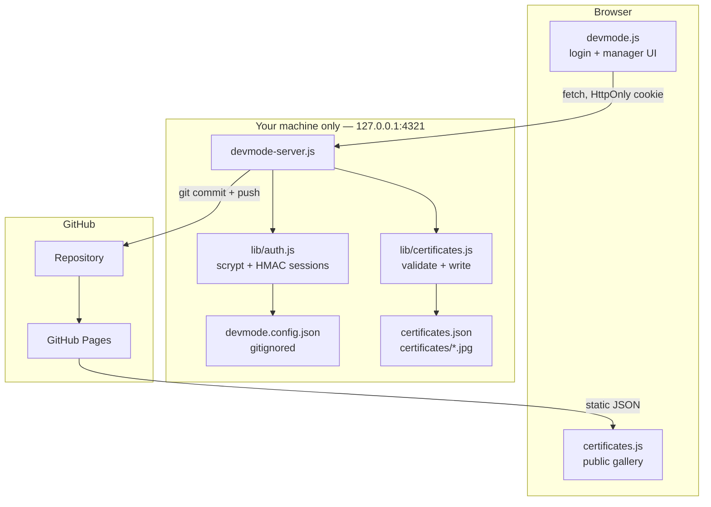
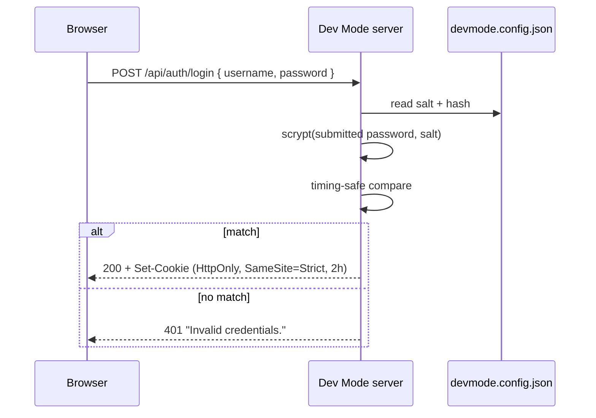
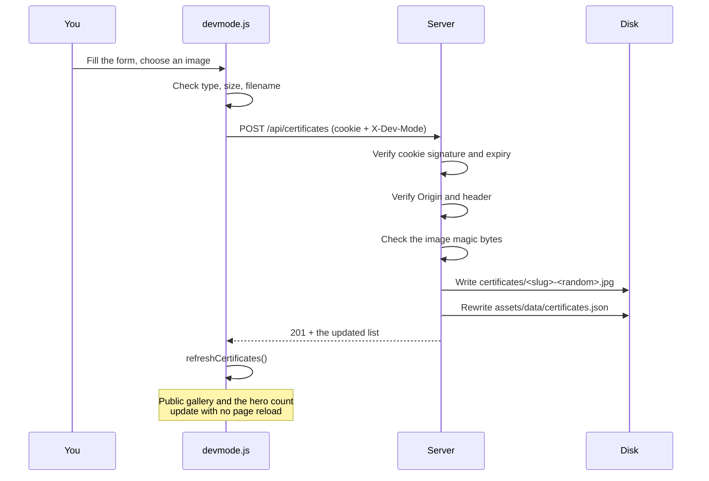

# Dev Mode — Certification Management

How the private certification manager works, and why it is built this way.

---

## 1. The problem it solves

The public portfolio is a **static GitHub Pages site**. A static host has two
properties that matter here:

1. It can only serve files. There is no server-side code to run.
2. Everything it serves is public. It cannot keep a secret.

That rules out the obvious approach. Putting a password check in the browser —

```js
if (username === '*******' && password === '******') { /* ... */ }   // never do this
```

— is not authentication. Anyone can read it with **View Source**. The same is
true of an API token: shipping one to the browser publishes it.

So the read path and the write path are deliberately split.

| Path | Where it runs | Who can reach it |
| --- | --- | --- |
| **Read** — display certificates | GitHub Pages, static | Everyone |
| **Write** — add / edit / delete | A local Node server on your machine | Only you |

Both sides share one file, `assets/data/certificates.json`. The public site
reads it. Dev Mode writes it.

---

## 2. Architecture



### Files

| File | Responsibility |
| --- | --- |
| `server/devmode-server.js` | HTTP server, routing, request guards, publish |
| `server/lib/auth.js` | Password hashing, sessions, rate limiting |
| `server/lib/certificates.js` | Validation, image writing, manifest updates |
| `server/devmode.config.json` | Password hash and session secret — **gitignored** |
| `assets/js/devmode.js` | The UI. Holds no credentials and no tokens |
| `assets/js/certificates.js` | Renders the public gallery, reads the manifest |
| `assets/data/certificates.json` | The manifest — single source of truth |
| `certificates/` | The image files |

---

## 3. Authentication

### Where the password lives

It is **never** in any file that gets committed. On first run the server creates
`server/devmode.config.json` with permissions `0600` and writes a
**scrypt hash**, not the password itself:

```
scrypt(password, salt, { N: 16384, r: 8, p: 1, keylen: 64 })
```

scrypt is deliberately slow and memory-hard, so guessing at scale is expensive.
The salt is 16 random bytes, so two identical passwords produce different
hashes and precomputed tables are useless. The file is listed in `.gitignore`,
so it never reaches GitHub.

### The login exchange



The password is checked **on the server**. The browser only ever learns
"yes" or "no".

### The session cookie

```
vs_devmode=<payload>.<hmac>; Path=/; HttpOnly; SameSite=Strict; Max-Age=7200
```

- The payload is base64url; the signature is **HMAC-SHA256** over it, using a
  48-byte secret that exists only in your config file. Editing the payload
  invalidates the signature, so a session cannot be forged.
- `HttpOnly` means JavaScript cannot read it — `document.cookie` returns `""`.
  Even a successful XSS cannot steal it.
- `SameSite=Strict` means another site cannot make your browser send it.
- It expires after **2 hours**.

### Defences

| Attack | Defence |
| --- | --- |
| Brute force | 5 attempts per IP, then a 15-minute lockout |
| Username enumeration | Unknown users still run a full scrypt derivation, so timing does not leak whether the name exists. The error text is identical either way |
| Timing analysis on compare | SHA-256 normalise, then `timingSafeEqual` |
| Cookie forgery | HMAC signature over the payload |
| Cookie theft via XSS | `HttpOnly` |
| CSRF | An `X-Dev-Mode: 1` header is required, plus an `Origin` check. A plain cross-site form post cannot set custom headers |
| Session survival after a password change | Changing the password rotates the session secret, invalidating every existing session |

> **There is no sign-up.** There is exactly one account, created locally on
> first run. No registration endpoint exists.

---

## 4. Request flow for a write



Every guard runs **again on the server**. The browser-side checks exist only to
give fast feedback; they are not trusted, because anyone can call the API
directly.

### Endpoints

| Method | Route | Purpose |
| --- | --- | --- |
| `GET` | `/api/health` | Is Dev Mode running? The only route open without a session |
| `POST` | `/api/auth/login` | Exchange credentials for a session cookie |
| `POST` | `/api/auth/logout` | Clear the session |
| `GET` | `/api/auth/session` | Is the current session still valid? |
| `POST` | `/api/auth/password` | Change the password |
| `GET` | `/api/certificates` | List |
| `POST` | `/api/certificates` | Create |
| `PUT` | `/api/certificates/:id` | Update in place |
| `DELETE` | `/api/certificates/:id` | Remove |
| `POST` | `/api/publish` | Commit and push |

Everything except `/api/health` returns **401** without a valid session.

---

## 5. Upload safety

An image upload is the most dangerous input the server accepts, so it is
checked four ways.

**1. Declared type must be allowed** — only JPEG, PNG and WebP.

**2. Contents must match the declared type.** The first bytes of the file are
compared against the real signature:

| Format | Signature |
| --- | --- |
| JPEG | `FF D8 FF` |
| PNG | `89 50 4E 47 0D 0A 1A 0A` |
| WebP | `RIFF` at 0, `WEBP` at 8 |

Renaming `payload.exe` to `photo.png` is rejected with **415**. A file
extension is a claim, not a fact.

**3. Size cap** — 8 MB per image, 12 MB per request body.

**4. The filename is discarded.** The stored name is regenerated:

```
<slug-of-title>-<6 random hex chars>.<ext>
```

A hostile filename such as `../../index.html` therefore cannot influence where
the file lands. Deletion is also confined to the `certificates/` directory.

Credential URLs are filtered to `http:` and `https:` only, so a
`javascript:` URL cannot be stored and later rendered as a link.

---

## 6. Publishing

Saving writes to your disk immediately. Publishing is a separate, deliberate
step:

```bash
git add assets/data/certificates.json certificates
git diff --cached --quiet          # stop early if nothing changed
git commit -m "chore(certificates): update via Dev Mode"
git push
```

These run through `execFile`, **not** a shell, so no argument can be
interpreted as a shell command. Authentication uses **your existing git
credentials** — the server neither stores nor forwards a personal access token.

After the push, GitHub Pages redeploys and the public site serves the new
manifest.


`.github/workflows/update-certificates.yml` runs
`scripts/generate-certificates.js` after a push. That script **reconciles**
rather than regenerates: the manifest is the source of truth, so it appends
images that are not yet referenced and drops entries whose image is gone, but
it never overwrites a field you filled in.

---

## 7. What the public site sees

The authoring service only ever listens on loopback, so on any origin that is
not `localhost` or `127.0.0.1` the Dev Mode button is **removed from the page
entirely** — before the health probe is even attempted.

- Visitors never see the button, and cannot open a login form.
- The probe is skipped, so no `404` appears in the console.
- Nothing names the internal tooling to a visitor.
- Every API path is relative, so nothing points at your machine.
- No credential, hash or token is present in any published file.
- Visitors get exactly what they got before: a static JSON file and images.

The manager cannot be "hacked into" from the public site, because on the public
site **it does not exist**.

> An earlier build let the login panel open on GitHub Pages and explain that
> the service was not running. It could not be logged into, but it looked
> broken and it disclosed the server's start command, so the button is now
> removed instead.

---

## 8. Running it

Double-click **`start-devmode.cmd`** in the project folder. It starts the
server and opens the site for you. Keep the window open; closing it stops
Dev Mode.

The equivalent by hand:

```powershell
cd C:\Users\H553536\Documents\GitHub\vigneshcareer
node server/devmode-server.js
```

Either way, the site to use is <http://127.0.0.1:4321> — click the terminal
icon in the header. **Dev Mode does not work on the published GitHub Pages
URL**, because the server runs only on your machine.

The launcher prefers a system-installed Node and falls back to a portable copy
in `%LOCALAPPDATA%\vc-node`. If neither exists it prints the install command
rather than failing silently.

The server binds to `127.0.0.1` only, so it is not reachable from your network.
Stop it with <kbd>Ctrl</kbd>+<kbd>C</kbd>.

> On first run the server prints a warning while the default password is still
> in use. Change it from the key icon in the manager. Changing it also logs out
> every existing session.

---

## 9. Design rules

1. **The browser is never trusted.** Every check is repeated on the server.
2. **Secrets never travel to the browser.** No password, hash or token is sent.
3. **The manifest is the source of truth.** Automation reconciles against it.
4. **Writes are local; publishing is explicit.** Saving cannot surprise you by
   going public.
5. **Failures are quiet and identical.** Error messages never reveal whether a
   username exists.
